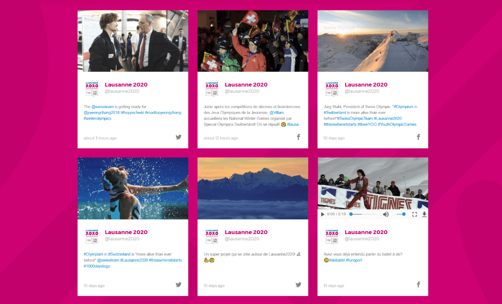

# Jekyll Brand Social Wall :barber:
A jekyll plugin to generate a social wall with your favorite social networks



## What it does in 3 lines
 * Fetch your last posts from different social networks
 * Mix and sort them by date and time
 * Render HTML Markup

## Why you should use it
 * Compared to all other js plugin, it doesn't expose any of your credentials
 * No need of real time update if your social accounts have no more than few news every day
 * Lightweight and cacheable

## The Social Wall Definition

A **social wall** is a posts aggregator from multiple social networks. It combines them, display them and give to the public an insight of the social activity and the latest news of a brand.

Synonyms: Social.... Flow, Feeds, Board, Stream, Wall, Cards, Hub, Media Aggregator, Network wall, Tagboard

### Various layouts

[](https://github.com/kombai/freewall)  | [](https://github.com/kombai/freewall)  | [](https://github.com/kombai/freewall)  |  [](https://github.com/kombai/freewall) |  |  |
 --- | --- | --- | --- | --- | --- | ---
 Flexible Layout | Images show | Pinterest-like | Windows style | Fixed size |  Timeline | Another Layout?

Images from @Kombai plugin under the MIT license

### What do you want to highlight?
Examples of criteria or questions you should ask yourself or your client:
Some questions might need to improve this plugin !

 - Which number of posts to display (for all networks ? One network is preferred ?)
 - Do you need Hashtags filters ?
 - Show to your public one or many accounts (external: retweet, hashtags,...)
 - Sort by ? Date (usually newest), most liked/retweet/favorite posts,...
 - Which media to prioritize ? Text vs Pictures ? Video, GIF ?

## Installation

1. Copy the folder `social_wall`  into `_plugins`  within your Jekyll project.
2. Generate your social networks credentials
 - Facebook
    - Create and app: https://developers.facebook.com/docs/apps/register
 - Twitter
    - https://dev.twitter.com/oauth/overview
3. Create a `.env` file with your social networks credentials

  ```
  # Facebook credentials

  FACEBOOK_ACCESS_TOKEN=myaccestoken
  FACEBOOK_SECRET=mysecret

  # Twitter credentials

  TWITTER_CONSUMER_KEY=myconsumerkey
  TWITTER_CONSUMER_SECRET= myconsumersecret
  TWITTER_OAUTH_TOKEN=myoauthtoken
  TWITTER_OAUTH_TOKEN_SECRET=myoauthtokensecret
  ```
4. Install the following gem by adding them to your `_config.yml` and running `bundle install`

  ```yaml
  gem 'dotenv', :groups => [:development, :test]

  gem "koala", "~> 2.2"

  gem "twitter", "~> 6.0.0"

  gem "mini_magick"

  gem 'nokogiri'

  gem 'metainspector'
  ```
5. Configure a webhook subscription every social network used
 - Facebook
    - https://developers.facebook.com/docs/graph-api/webhooks
 - Twitter
    - doesn't have their own Webhook service but you can use : https://zapier.com/zapbook/twitter/webhook/, https://ifttt.com/ ...
6. Customize the html template by rewriting the ruby files inside the `social_networks` folder
7. **Enjoy!**

## How To Use
Add the following liquid tag in any of your layout or pages. Every social network is optional. Remove `??_username` to disable one.

```liquid

```

### Parameters

Name| Description|Default Value| Limitation | Example
----|----|----|----|----
tw_username| any twitter username but only one! |  | | katyperry
tw_amount| exact number of tweets needed| 10 | [200](https://dev.twitter.com/rest/reference/get/statuses/user_timeline#parameters) | 36
tw_include_rts| retweets are fetched <sup>1</sup> | false | | true
fb_username| any facebook username but only one! | | | bbcnews
fb_amount| exact number of posts needed| 10 | limited | 10

1. No special template at the moment

## Output example

```html
<div class='twitter_status ext_quote col-sm-6 col-md-4 item'>
  <div class='wrap_status'>
      <blockquote cite="http://nyti.ms/2kFGFHj">
        <p class="story_img"><a href="http://nyti.ms/2kFGFHj"></a></p>
        <div class="wrap_story">
          <cite>www.nytimes.com</cite>
          <h1><a href="http://nyti.ms/2kFGFHj">Fears That Trump’s Visa Ban Betrays Friends and Bolsters Enemies - The New York Times</a></h1>
          <p class="desc">Officials, analysts and citizens across Muslim-majority countries said the order was a sign that President Trump sees Islam itself as the problem.</p>
        </div>
      </blockquote>
    <div class="user_info row">
      <p class="profile_image col-xs-3">
        <a href="http://twitter.com/nytimes"></a>
      </p>
      <div class="wrap_user_name col-xs-8">
        <h1 class="user"><a href="http://twitter.com/nytimes">The New York Times</a></h1>
        <h2 class="username"><a href="http://twitter.com/nytimes">@nytimes</a></h2>
      </div>
      <p class="icon_social col-xs-1">
        <a href="http://twitter.com/nytimes/status/825492425925861376"><span class="icon-twitter"></span></a>
      </p>
    </div>
    <div class="status_box">
      <p class="status desc">People across the Muslim world worry President Trump's executive order is a sign that he sees Islam as the problem </p>
    </div>
    <p class="meta_info">
      <time pubdate datetime="2017-01-28T23:55:05+00:00">2017-01-28T23:55:05+00:00</time>
        <a class="icon-reply" href="https://twitter.com/intent/tweet?in_reply_to=825492425925861376" ></a>
        <a class="icon-loop" href="https://twitter.com/intent/retweet?tweet_id=825492425925861376" ></a>
        <a class="icon-heart" href="https://twitter.com/intent/favorite?tweet_id=#825492425925861376" ></a>
    </p>
  </div>
```

## Futures Features
- [ ] Stripping multilingual duplicate posts (Facebook offer since 2016, multilingual post but doesn't support it in graph api)
   - https://github.com/simplificator/babel
   - https://github.com/feedbackmine/language_detector
   - https://github.com/peterc/whatlanguage
   - https://github.com/vhyza/language_detection
   - https://github.com/detectlanguage/detectlanguage-ruby
- [ ] Twitter Video/Gif support (01/2017 Some wrong media type detection occurs with twitter api)
- [ ] Option to include hashtags posts for both Facebook and Twitter
- [ ] Implement a global filter amount for all social networks
- [ ] Support for others social networks
  - Instagram
  - Youtube
  - Linkedin
  - Google+
  - VK
  - ...
